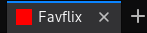

+++
title = "FavFlix: lecteur vidéo dans la favicon"
date = 2018-10-02
description="Comment lire une vidéo dans la favicon"
+++

Ne vous êtes-vous jamais demandé comment regarder une vidéo dans la favicon d'un site?
Vous savez, la [favicon](https://developer.mozilla.org/en-US/docs/Learn/HTML/Introduction_to_HTML/The_head_metadata_in_HTML#Adding_custom_icons_to_your_site): cette petite image qui apparait dans les onglets du navigateur?

Non, vous ne vous êtes jamais posé cette question?
Cela semble complètement inutile? Effectivement! C'est donc parfaitement indispensable.

Pourtant, [voilà ce que ça donne](demo.html).

<!-- more -->

## Contexte

16x16 pixels, c'est amplement suffisant pour stimuler l'imagination.
On peut même imaginer passer à 32x32 pixels et appeler ça de la HD.

Notre terrain de jeu sera le fichier HTML suivant:

```html
<!DOCTYPE html>
<html>
  <head>
    <title>Favflix</title>
    <link id="favicon" rel="icon" href="" type="image/png" sizes="16x16">
  </head>
  <body>
    <script src="index.js"></script>
  </body>
</html>
```

Seuls deux éléments sont nécessaires:

- la favicon, avec un id original nous permettant de récupérer l'élément
- le script `index.js` que nous allons maintenant écrire

## Modifier la favicon dynamiquement

Comme les images, la favicon a un attribut `href` permettant de définir la source de l'image.
Et comme pour les images, il est possible de passer une [data URI](https://developer.mozilla.org/en-US/docs/Web/HTTP/Basics_of_HTTP/Data_URIs).
Cela revient à passer l'image encodée en [base64](https://fr.wikipedia.org/wiki/Base64) en tant que source.

Ok, on avance: il nous faut donc maintenant une image en base64.

Avant de commencer à dessiner, il nous faut une feuille (et une bière, parfois).

Sortons donc notre plus bel éditeur - neovim - et commençons par se créer un [canvas](https://developer.mozilla.org/fr/docs/Web/HTML/Element/canvas).
On récupère du canvas un contexte 2d - appelons le context -, qui va nous permettre d'exprimer notre sens artistique aigu.
Puis, barbouillons gaiement de la couleur là-dedans: un joli rectangle rouge.

Pour récupérer l'image en base64, utilisons la méthode `toDataURL` de l'objet _canvas_.
Enfin on passe cette dataURL au href de la favicon.

```js
document.addEventListener('DOMContentLoaded', () => {
  const favicon = document.getElementById('favicon');
  const favSize = 16;

  const canvas = document.createElement('canvas');
  canvas.width = favSize;
  canvas.height = favSize;

  const context = canvas.getContext('2d');

  context.fillStyle = '#ff0000';
  context.fillRect(0, 0, favSize, favSize);

  favicon.href = canvas.toDataURL('image/png');
}
```

Contemplons notre chef-d'œuvre: rectangle rouge sur fond rouge:



Bien, nous savons comment modifier la favicon: reste à récupérer les informations de la vidéo.

## Récupérer les frames de la vidéo

On va se faire un petit objet, appelons le _updater_, qui sera responsable de mettre à jour la favicon.
Pour commencer, quelques constantes:

```js
const updater = {
  favSize: 32,
  refresh: 100,
  ...
}
```

Une favicon de 16x16, c'est vraiment trop petit, en 32x32 on peut mieux lire les sous-titres.
_refresh_ correspond au nombre de millisecondes entre deux rafraichissement de la favicon.
En dessous de 100 le navigateur galère et n'affiche plus rien.

Dans la méthode _setup_ on se récupère les éléments nécessaires à notre bricolage.

```js
  setup: function() {
    this.video = document.getElementById('video');
    this.canvas = document.createElement('canvas');
    this.canvas.width = this.favSize;
    this.canvas.height = this.favSize;
    this.ctx = this.canvas.getContext('2d');
    this.favicon = document.getElementById('favicon');
    this.video.addEventListener('canplay', () => { this.setVideoSize(); });
    this.video.addEventListener('play', () => { this.callback(); });
    // Black background
    this.ctx.fillStyle = '#000000';
    this.ctx.fillRect(0, 0, this.favSize, this.favSize);
  },
```

Dans les grandes lignes:
- les éléments du DOM vidéo et favicon sont récupérés, on créé un canvas;
- deux callbacks sont définis;
- le canvas est initialisé avec un fond noir;

L'événement _canplay_ est émis lorsqu'une portion suffisante de la vidéo a été chargée,
le navigateur est alors prêt à commencer la lecture.
Sur cet événement nous sommes certain d'avoir la taille de la vidéo,
c'est donc le bon moment pour préparer la mise à l'échelle des images.

```js
  setVideoSize: function() {
    this.vidWidth = this.favSize;
    // Handle 16/9
    this.vidHeight = Math.floor(this.video.videoHeight / this.video.videoWidth * this.vidWidth);
    // Vertically center the video
    this.vOffset = Math.round((this.favSize - this.vidHeight) / 2);
  },
```

La largeur est fixée au maximum possible, c'est-à-dire la largeur de la favicon.
La hauteur est déterminée à partir de la largeur pour conserver le ratio.
On ne gère donc pas les vidéos prise avec un smartphone en portrait.
En même temps, si c'est gênant, penchez la tête.
Enfin on calcul un _vOffset_, le décalage vertical de l'image pour la centrer dans la favicon.
On aura des bandes noires au dessus et en dessous de l'image: comme au cinéma!

Lors de l'événement _play_ de la vidéo, le callback va déterminer si la vidéo est terminée ou en pause.
Dans le cas contraire on gère la frame et on se place un timer pour relancer le callback 100 ms plus tard.

```js
  callback: function() {
    if (this.video.paused || this.video.ended) {
      return;
    }
    this.handleFrame();
    setTimeout(() => { this.callback(); }, this.refresh);
  },
```

Il reste à écrire la méthode _handleFrame_, qui ne fera rien de plus qu'un copier/coller.

```js
  handleFrame: function() {
    this.ctx.drawImage(this.video, 0, vOffset, vidWidth, vidHeight);
    this.favicon.href = this.canvas.toDataURL('image/png');
  },
```

La vidéo est balancée dans le canvas, avec les contraintes de taille et de position précédemment calculés.
La favicon est ensuite mise à jour lorsqu'on remplace son attribut _href_ par la dataURL du canvas.

On oublie pas de lancer notre _setup_ au chargement de la page:

```js
document.addEventListener('DOMContentLoaded', () => {
  updater.setup();
});
```

Il ne reste plus qu'à chercher le popcorn, monter le son et profiter de pouvoir regarder
le seigneur des anneaux en version longue au boulot.
Sur l'onglet du navigateur.

[La démo! La démo!](demo.html)
